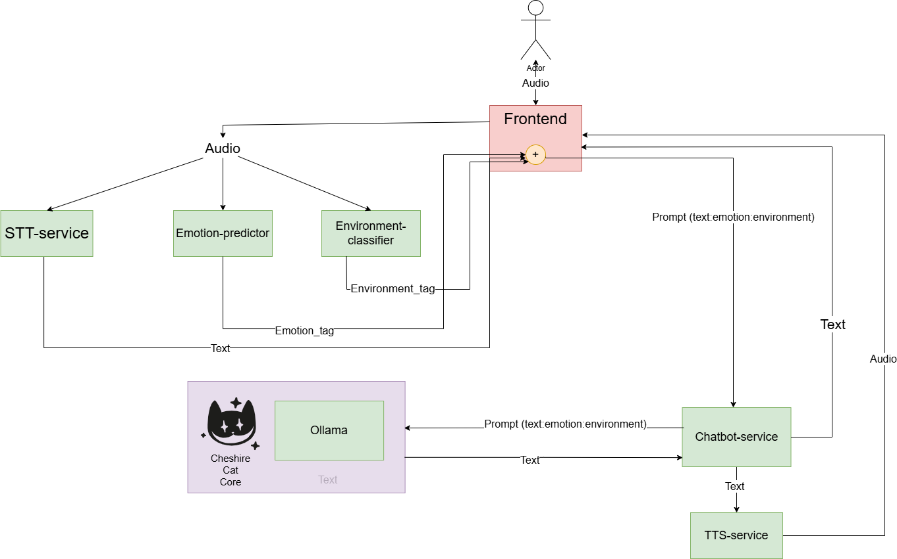

Ecco come aggiungere il passaggio per l'attivazione del plugin Emotional Agent nel README.md:

# Emotive-chatbot

# Guida alla Configurazione di Cheshire Cat Core

## Prima Configurazione

Quando si avvia Cheshire Cat Core per la prima volta, è necessario configurare manualmente l'integrazione con Ollama seguendo questi passaggi:

1. Aprire il browser e andare all'indirizzo: [http://localhost:1865/admin](http://localhost:1865/admin)

2. Effettuare l'accesso con le seguenti credenziali predefinite:
   - **Username**: `admin`
   - **Password**: `admin`

3. Nel pannello di amministrazione, navigare su **Settings → Large Language Model → Configure**

4. Inserire i seguenti parametri:
   - **Service**: `Ollama`
   - **Base URL**: `http://host.docker.internal:11434`
   - **Model**: `llama3.2:3b`

5. Cliccare sul pulsante **Save** per applicare la configurazione

6. Attivare il plugin Emotional Agent andando su **Plugins → Emotional Agent plugin** e imposta lo switch su **on**

## Note Importanti

- Il modello `llama3.2:3b` viene scaricato automaticamente all'avvio del container Ollama grazie al servizio `init-ollama`
- La prima esecuzione potrebbe richiedere più tempo per completare il download del modello
- Le configurazioni dei servizi sono gestite tramite variabili d'ambiente nel file `.env`
- I modelli scaricati vengono salvati nel volume persistente `./ollama-models`
- Il plugin Emotional Agent permette al chatbot di adattare le risposte in base alle emozioni rilevate nell'utente
- Se dovessero verificare problemi di comunicazione tra i vari microservizi **riavviare container api-gateway**

Dopo aver completato questa configurazione, il sistema sarà pronto all'uso con l'integrazione tra Cheshire Cat Core e Ollama correttamente impostata.

## Architettura del sistema
L'architettura del sistema è la seguente:

